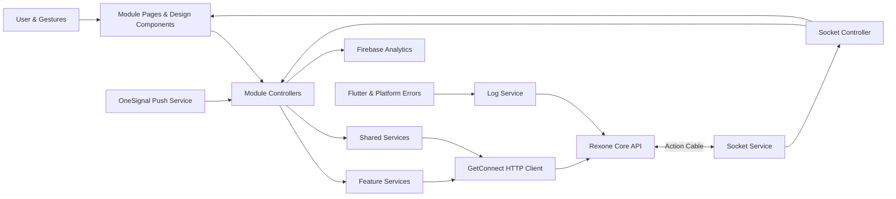

<a id="readme-top"></a>

<div align="center">

# Rexone Mobile

### A disciplined Flutter client, built to turn a powerful foundation into a seamless mobile product experience.

A production-minded mobile foundation for authenticated applications. Identity, payments, access control, media, AI, real-time delivery, push notifications, product analytics, in-app updates, localization, client telemetry, and reusable design primitives meet here—not as disconnected demos, but as one cohesive mobile application.

Built under the same creed as Rexone Core and Rexone Web: **clear in thought, exact in structure, simple in use, and strong enough to endure what comes after launch.**

[](https://flutter.dev/)
[](https://dart.dev/)
[](https://pub.dev/packages/get)
[](https://firebase.google.com/)
[](https://onesignal.com/)

**Typed · Modular · Localized · Observable · Push-ready · Analytics-enabled · API-driven · Fully Tested**

[Explore the foundation](#feature-map) · [Ecosystem Architecture](ECOSYSTEM.md) · [Development Law](LAW.md) · [Run it locally](#getting-started) · [Meet the architecture](#architecture) · [E2E Testing](#end-to-end-testing-flutter-driver) · [Connect the API](#configuration--environment-management)

</div>

---

> [!IMPORTANT]
> **🏛️ Unified Ecosystem**: For the complete cross-platform architecture, feature parity matrix, and communication protocols between Core, Web, and Mobile, see **[ECOSYSTEM.md](ECOSYSTEM.md)**.
>
> **📜 Constitutional Law**: All development must strictly adhere to the architecture, design system, and state laws in **[LAW.md](LAW.md)**. Zero exceptions.

## Why Rexone Mobile?

A capable backend and a polished web app are only parts of the whole product. The mobile application must navigate device lifecycles, volatile network conditions, push notifications, app store version migrations, real-time socket events, platform sessions, biometric/passcode verification, and structured error telemetry.

Rexone Mobile exists so that work does not have to be reinvented for every mobile application built on Rexone Core.

This is not a template of screens pretending to be an architecture. Feature modules, shared services, models, bindings, design primitives, and telemetry pipelines have exact and deliberate responsibilities:

- **Modules** own a product feature end to end — pages, controllers, and (when needed) that feature's HTTP client — behind a single barrel export.
- **Shared services** are thin, single-responsibility clients for transport that is not feature-owned: HTTP, Action Cable, Firebase, OneSignal, storage, and client logs.
- **Design primitives** enforce consistent spacing, typography, and theme tokens across light and dark modes.
- **Observability listeners** automatically capture uncaught Flutter and platform errors and ship structured diagnostic payloads to Rexone Core's client log store.

The client is designed to **bend around the product**, never to make the product kneel before the foundation.

---

## The philosophy

Rexone Mobile follows the same doctrine as the ecosystem it serves:

> **Clarity before cleverness. Precision before haste. Simplicity without weakness. Strength without spectacle.**

The difficult part of mobile engineering is rarely rendering another screen. It is preserving a codebase that remains understandable when routes multiply, background workers fire, push payloads arrive while the app is backgrounded, API contracts evolve, and multiple developers build in parallel.

So the ambition was never to build the most complex state tree possible.

It was to build a **clear mobile foundation**—strong enough to carry ambitious products, flexible enough to surrender its shape to them, and disciplined enough that any developer can trace data from interaction to API and back without archaeology.

---

## Feature map

| Foundation             | What is ready                                                                            | Details                                                              |
| ---------------------- | ---------------------------------------------------------------------------------------- | -------------------------------------------------------------------- |
| **Identity**           | Email/password flow, OTP verification, recovery, Google sign-in, platform sessions       | [Authentication & security](#authentication--security)               |
| **Profile**            | Settings account row opens Profile; camera/gallery photo pick (local preview only)       | [Profile](#profile)                                                  |
| **Push Notifications** | OneSignal push messaging, permission management, user tag syncing, and click routing     | [Push notifications](#push-notifications)                            |
| **Product Analytics**  | Firebase Analytics screen tracking, auth lifecycle events, and telemetry                 | [Product analytics](#product-analytics)                              |
| **In-App Upgrades**    | Upgrader alert system supporting soft and hard store version prompts                     | [In-app version upgrader](#in-app-version-upgrader)                  |
| **Commerce**           | Products, Stripe Checkout WebView, subscriptions, and cancel/resume workflows            | [Payments & entitlements](#payments--entitlements)                   |
| **AI Assistant**       | Non-blocking queued chat, persistent room history, and Action Cable notifications        | [AI capabilities](#ai-capabilities)                                  |
| **Real Time**          | Action Cable WebSocket client, subscription channels, and global toast dispatching       | [Real-time delivery](#real-time-delivery)                            |
| **Observability**      | Flutter and platform error capture with automated client log delivery to Rexone Core     | [Client observability & telemetry](#client-observability--telemetry) |
| **Design System**      | Centralized design tokens, theme extensions, custom components, and light/dark modes     | [Design system](#design-system)                                      |
| **Localization**       | English, Spanish, and Burmese with dynamic runtime switching and `X-Locale` backend sync | [Localization](#localization)                                        |
| **Testing (E2E)**      | Real on-device automated user journey specs via Flutter Integration Test Driver          | [End-to-End Testing](#end-to-end-testing-flutter-driver)             |
| **Quality**            | Strongly typed Dart models, analyzer compliance, and automated test suite                | [Quality & testing](#quality--testing)                               |

---

## Architecture

Rexone Mobile keeps framework concerns explicit, responsibilities separated, and external providers isolated.



### Layer Boundaries:

- `lib/modules/` owns product features. Each module keeps its pages, controllers, and optional feature service together, and exposes them through a barrel file (`auth.dart`, `payment.dart`, …).
- `lib/controllers/` holds only app-wide coordinators that do not belong to one feature — today, `SocketController`.
- `lib/services/` holds shared infrastructure: HTTP (`ApiService`), Action Cable, Firebase Analytics, OneSignal, storage, device permissions, and client logs.
- `lib/design/` centralizes design tokens, theme definitions, extensions, and reusable UI components.
- `lib/bindings/` handles centralized dependency injection for shared services and permanent controllers. Feature controllers that are route-scoped (Payment, Checkout, AI, Profile) are bound on their `GetPage`.
- `lib/models/` contains strongly typed JSON:API models, pagination metadata (`PaginationMeta`, `PaginatedResponse`), and response envelopes.
- `lib/locales/` contains multi-language translations and runtime dictionary updates.
- `lib/config/` and `lib/constants/` manage environment definitions, typed JSON keys (`JsonKeys`), log constants (`LogConstants`), and application constants.
- `integration_test/` houses end-to-end integration specifications, test robots, and test data factories.
- `test_driver/` houses the Flutter driver entrypoint bridging device execution with test reporting.

---

## The client in detail

### Authentication & security

- **Smart Email Discovery**: Automatically checks user registration and confirmation state via `GET /peek`.
- **6-Digit Password**: In-memory password handling for sign-in and registration (credentials never leak to persistent storage or route arguments).
- **Unconfirmed Drop-off Recovery**: Returning unconfirmed users route directly to email confirmation OTP, bypassing credentials setup.
- **Escalating Attempt Protection**: Reactive password retry limits and cooldown counters driven dynamically by rexone-core.
- **Email Confirmation**: 6-digit email OTP verification with countdown-guarded resend capabilities.
- **Google Sign-In**: Native Google OAuth flow with Rexone Core challenge token support for first-time signups.
- **Active Session Enforcement**: Sends `X-Platform: mobile` to ensure single-device active session rules enforced by the backend cache.
- **Session Replacement Handling**: Detects active session invalidation and gracefully routes the user to sign-in with localized feedback.

### Profile

- Own feature module at `lib/modules/profile/` (route-scoped `ProfileController` on `/profile`).
- Opened from the Settings account row (`AppRoutes.toProfile`).
- Prefills full name, username, and email from the signed-in `UserModel`. Email is read-only.
- Edit badge on the avatar opens a camera or gallery sheet (`image_picker`). Save PUTs name/username on `/v1/users/current` and uploads a picked avatar.
- Camera and photo-library prompts go through shared `PermissionService` (same Settings dialog pattern as the AI microphone).

### IAM & RBAC Administrative Hierarchy

The mobile client enforces a synchronized three-tier administrative hierarchy:

- **`super_admin`**: Full authority across all features, screens, and administrative tools.
- **`admin`**: Full authority across domain operations (`feedbacks`, `payments`, `ai`, `assets`, `logs`), strictly excluded from `users` and `iam`.
- **Partial Admins (`*_admin` naming convention)**: Users holding the base `user` role plus a specific `*_admin` role (e.g. `feedback_admin`). Any role with `admin` in its name is an admin role. Permissions in admin roles grant access to both standard and admin endpoints, whereas permissions in non-admin roles (such as `user`) only grant access to non-admin features.

### Push notifications

- Powered by **OneSignal Flutter SDK** (`onesignal_flutter`).
- Native push notifications for Android and iOS (`remote-notification` background modes).
- User identification and tag synchronization (`syncUser(user)` and `clearUser()`) hooked directly into authentication state changes.
- Click listeners that route notifications and track conversion events via `AnalyticsService`.

### Product analytics

- Powered by **Firebase Analytics** (`firebase_core` & `firebase_analytics`).
- Automatic screen tracking via `FirebaseAnalyticsObserver` registered in `GetMaterialApp.navigatorObservers`.
- Pre-defined event tracking for sign-up, sign-in, sign-out, password resets, onboarding, and error captures via `Constants.analytics`.
- User ID tagging synchronized with authenticated sessions.

### In-app version upgrader

- Powered by **Upgrader** (`upgrader`).
- Configured in `main.dart` wrapping the root application builder.
- Checks App Store and Play Store releases to display customizable update dialogs for outdated installations.

### Payments & entitlements

- Product catalogue with one-time and recurring pricing and pagination support.
- In-app Stripe Checkout handoff via WebView (`webview_flutter`).
- Subscription state management (Active, Scheduled for Cancellation, Expired).
- Safe end-of-period cancellation and resumption guarded by destructive confirmation dialogs.

### AI capabilities

- Non-blocking conversational AI assistant backed by Rexone Core and DeepSeek.
- Multi-room management with persistent chat history and pagination support.
- Real-time response completion notifications delivered via Action Cable.
- Room deletion and chat clearing guarded by destructive confirmation prompts.

### Real-time delivery

- Real-time WebSocket connection to Rexone Core via Action Cable (`SolidCable`).
- Auto-reconnect and token refresh on authentication.
- Centralized `SocketController` dispatches notifications and manages global toast feedback.

### Client observability & telemetry

- Global error capture through `FlutterError.onError` and `PlatformDispatcher.instance.onError`.
- Structured diagnostic payloads (message, stack trace, device metadata, OS version, app version, local storage keys) delivered directly to Rexone Core's `POST /v1/log/clients`.
- Environment names validated against canonical backend schemas (`development`, `staging`, `production`).

### Design system

- Centralized design entry point via `import 'package:rexone_mobile/design/design.dart';`.
- Complete design tokens: `Design.spacing`, `Design.typography`, `Design.icons`, and `Design.timers`.
- Theme extensions for theme-aware colors and typography (`context.colors`, `context.typo`).
- Reusable components: `AppButton`, `AppInputField`, `AppPasswordField`, `AppDialog`, `AppLoading`, `AppPage`, and `AppSnackbar`.
- Cohesive light and dark themes with persistent user preferences.

### Localization

- Fully localized into:
  - 🇬🇧 **English (`en_US`)**
  - 🇪🇸 **Spanish (`es_ES`)**
  - 🇲🇲 **Burmese (`my_MM`)**
- Complete parity across all user-facing texts with dynamic runtime GetX translation reload.
- Automatically sends `X-Locale` and `Accept-Language` headers on all HTTP requests to ensure backend responses match the user's selected language.

---

## Speech & AI Assistant

Rexone Mobile pairs reactive GetX UI with real-time audio and AI capabilities:

- **Live Voice Dictation (STT)**:
  - Microphones stream normalized 16-bit PCM chunks to Core's ActionCable `SpeechLiveChannel` in real time.
  - Interactive `VoiceLevelBars` wave animation visualizes live amplitude and voice input levels.
  - Seamless fallback with automatic cancellation and error handling.
- **Text-to-Speech (TTS) Playback**:
  - Direct binary audio stream playback via `just_audio` / `AudioPlayer` without base64 overhead.
  - Message-level speech synthesis button with animated loading states and playing indicators.
  - Background completion notifications (`tts_ready`) dynamically link generated MP3 assets to assistant message bubbles.
- **Conversational AI Chat**:
  - Non-blocking queued AI chat execution with persistent conversation rooms and message history.
  - Optimistic UI updates with live thinking indicators and ActionCable socket synchronization.

---

## End-to-End Testing (Flutter Driver)

Rexone Mobile includes on-device E2E tests built with **`package:integration_test`** and Flutter Driver. Tests exercise real user flows on active iOS Simulators or Android Emulators without mocking UI behavior.

### Test Structure

```text
rexone_mobile/
├── integration_test/
│   ├── auth/
│   │   ├── password_test.dart       # Password acceptance, rejection, and retries
│   │   ├── password_reset_test.dart # Forgot password request flow
│   │   ├── sign_in_test.dart        # End-to-end sign-in, drop-off recovery & home navigation
│   │   ├── sign_out_test.dart       # Sign out & session termination
│   │   ├── sign_up_test.dart        # Full registration & email confirmation
│   │   └── sso_test.dart            # Google SSO button presence & interaction
│   ├── data/
│   │   └── users.dart               # Test user definitions & dynamic factory
│   └── robots/                      # Test Robot helper classes
├── test_driver/
│   └── integration_test.dart        # Flutter Driver bridge entrypoint
└── scripts/
    ├── test.sh                   # Full test suite runner (Unit + E2E)
    ├── test_unit.sh              # Flutter unit test runner
    └── test_e2e.sh               # Mobile E2E runner CLI
```

### Running Tests

Rexone Mobile provides specialized and unified test runner scripts in [`scripts/`](scripts/):

```bash
# 1. Run FULL test suite (Unit + E2E)
./scripts/test.sh all -d emulator-5554

# 2. Run ONLY Unit tests (Flutter Test) - fast feedback loop
./scripts/test_unit.sh
# or: flutter test

# 3. Run ONLY E2E tests (Flutter Drive / Integration Test)
./scripts/test_e2e.sh all -d emulator-5554

# Run specific E2E flows
./scripts/test_e2e.sh sign-in -d emulator-5554
./scripts/test_e2e.sh sign-up -d emulator-5554
./scripts/test_e2e.sh password -d emulator-5554
./scripts/test_e2e.sh password-reset -d emulator-5554
./scripts/test_e2e.sh sign-out -d emulator-5554
./scripts/test_e2e.sh sso -d emulator-5554

# Or run on iOS Simulator
./scripts/test_e2e.sh sign-in -d "iPhone 16 Pro"
```

Or run via Flutter Driver directly:

```bash
flutter drive \
  --driver=test_driver/integration_test.dart \
  --target=integration_test/auth/sign_in_test.dart \
  -d emulator-5554
```

---

## Getting started

### Prerequisites

- **Flutter SDK**: `>= 3.11.5`
- **Dart SDK**: `>= 3.11.5`
- **Android Studio** / **VS Code** with Flutter extensions
- **Xcode** (for iOS development on macOS)
- **CocoaPods** (for iOS dependency management)

Verify your environment:

```sh
flutter doctor
```

### Installation

1. Clone the repository:

```sh
git clone git@github.com:rex-9/rexone-mobile.git
cd rexone-mobile
```

2. Install dependencies:

```sh
flutter pub get
```

3. Configure environment variables:
   Create `.env.dev`, `.env.uat`, or `.env.prod` in the project root:

```env
APP_NAME=Rexone
APP_VERSION=1.0.0
API_BASE_URL=http://10.0.2.2:3000
GOOGLE_SERVER_CLIENT_ID=your_google_server_client_id.apps.googleusercontent.com
ONE_SIGNAL_APP_ID=your_onesignal_app_id
ANDROID_APP_ID=com.rexone.mobile
IOS_APP_ID=com.rexone.mobile
```

4. Configure Firebase & Google Services:

- **Android**: Copy `android/app/google-services.json.example` to `android/app/google-services.json` and configure your Firebase project values.
- **iOS**: Copy `ios/Runner/GoogleService-Info.plist.example` to `ios/Runner/GoogleService-Info.plist` and configure your Firebase project values.

> [!NOTE]
> `google-services.json` and `GoogleService-Info.plist` are included in `.gitignore` to prevent credential exposure.

---

## Running the application

### Development:

```sh
flutter run --dart-define=APP_ENV=.env.dev
```

### Staging (UAT):

```sh
flutter run --dart-define=APP_ENV=.env.uat
```

### Production:

```sh
flutter run --dart-define=APP_ENV=.env.prod
```

---

## Quality & testing

Run static analysis:

```sh
flutter analyze lib/ test/ integration_test/
```

Run unit and widget tests:

```sh
flutter test test/
```

Run on-device integration tests:

```sh
./scripts/test.sh all -d emulator-5554
```

---

## Building for production

### Android APK:

```sh
flutter build apk --release --dart-define=APP_ENV=.env.prod
```

### Android App Bundle (AAB):

```sh
flutter build appbundle --release --dart-define=APP_ENV=.env.prod
```

### iOS Release:

```sh
flutter build ios --release --dart-define=APP_ENV=.env.prod
```

---

## Project structure

```text
rexone_mobile/
├── android/                  # Android native project & Gradle config
├── ios/                      # iOS native project & CocoaPods config
├── integration_test/         # On-device integration tests & test robots
├── lib/
│   ├── bindings/             # GetX DI for shared services and permanent controllers
│   ├── config/               # App configuration and environment resolution
│   ├── constants/            # Constants, analytics event keys, locale keys, HTTP status
│   ├── controllers/          # App-wide coordinators only (SocketController)
│   ├── design/               # Design system (tokens, components, extensions, themes, icons)
│   │   ├── components/       # Reusable atoms and molecules (Button, Input, Password, Dialog, Loading)
│   │   ├── elements/         # Design tokens (Colors, Spacing, Typography, Icons, Timers)
│   │   └── extensions/       # Theme context extensions
│   ├── helpers/              # Utility helpers (API JSON:API parser, flags, validators)
│   ├── locales/              # Multi-language translations (en_US, es_ES, my_MM)
│   ├── models/               # Strongly typed models and JSON:API response envelopes
│   ├── modules/              # Feature modules (pages + controllers + feature services)
│   │   ├── splash/           # Launch / session restore
│   │   ├── auth/             # Welcome, password, signup, OTP, recovery
│   │   ├── home/             # Main dashboard
│   │   ├── payment/          # Plans, Stripe Checkout WebView, subscriptions
│   │   ├── profile/          # Account profile, avatar upload
│   │   ├── setting/          # Theme, language, and account row
│   │   └── ai/               # Assistant chat, rooms, history
│   ├── routes/               # GetX route declarations and auth route guards
│   └── services/             # Shared transport (API, Socket, Log, Analytics, Push, Storage, Permissions)
├── scripts/
│   ├── rebrand.sh             # Unified mobile rebranding (Name + Package + Icon)
│   ├── update_app_name.sh     # App display name updater (Android, iOS, .env)
│   ├── update_package_name.sh # Package identifier / Bundle ID updater
│   ├── update_app_icon.sh     # Launcher icons generator
│   ├── update_app_version.sh  # Version and build number incrementer
│   ├── test.sh                # Full test suite runner (Unit + E2E)
│   ├── test_unit.sh           # Flutter unit test runner
│   └── test_e2e.sh            # E2E integration test CLI runner
├── test/                      # Unit, controller, and localization tests (88 tests)
│   ├── controllers/           # Socket controller tests
│   ├── mocks/                 # In-memory test service doubles
│   ├── modules/               # Auth, Notification, Feedback, Setting, Payment, AI controller tests
│   └── services/              # Speech and core service tests
├── test_driver/
│   └── integration_test.dart  # Flutter Driver test bridge
└── pubspec.yaml
```

---

## 🎨 Rebranding & Utility Scripts

> [!TIP]
> **Recommended**: For full, synchronized rebranding across all 3 platforms (Core Backend, Web SPA, and Mobile App), run the master rebrand engine from **`rexone-core`**:
> ```bash
> cd ../rexone-core && ./scripts/rebrand.sh
> ```

For standalone mobile development or isolated updates, you can use the local scripts below:

```bash
# 1. Standalone Mobile Rebrand (Name + Package ID + App Icon)
./scripts/rebrand.sh "New App Name" "com.company.newapp" "path/to/icon.png"

# 2. Update App Display Name only
./scripts/update_app_name.sh "New App Name"

# 3. Update Package Name / Bundle ID only
./scripts/update_package_name.sh com.company.newapp

# 4. Generate Launcher Icons from assets/brand/logo.png
./scripts/update_app_icon.sh

# 5. Bump Version and Build Number
./scripts/update_app_version.sh 1.1.0
```


---

## 🏛️ Ecosystem Lineage & Attribution

This application is built on top of the **Rexone Ecosystem** (`rex-9`). When creating derivative products or white-label applications:

- Developers and creators are warmly encouraged to preserve ecosystem credit in documentation to support the project.
- All development must strictly adhere to the constitutional engineering standards in **[LAW.md](LAW.md)** and **[ECOSYSTEM.md](ECOSYSTEM.md)**.

---

## Author

Built with Clarity & Simplicity Driven Development, by **Rex (Rex9)**.

A software engineer, full-stack architect, and long-time practitioner of meditation.

I build systems the same way I approach the path itself: **with a clear mind, deliberate steps, and no unnecessary weight.**

- GitHub: [@rex-9](https://github.com/rex-9)
- Portfolio: [rex9.vercel.app](https://rex9.vercel.app)
- LinkedIn: [rex9](https://www.linkedin.com/in/rex9/)

_Built with ❤️ by Rex9 on Rexone Ecosystem_

<p align="right"><a href="#readme-top">Back to top ↑</a></p>
