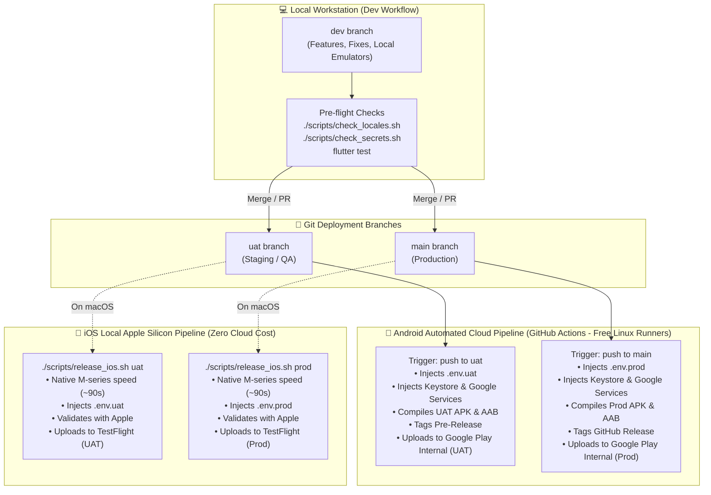
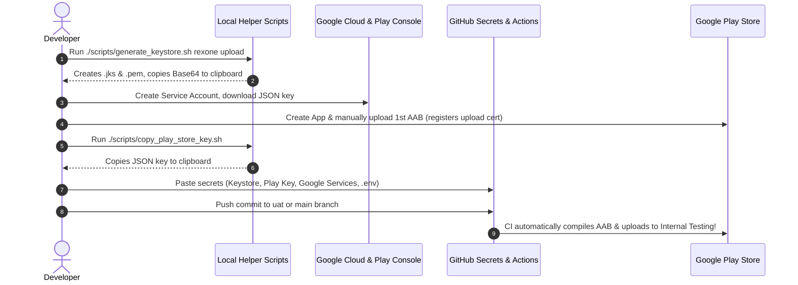
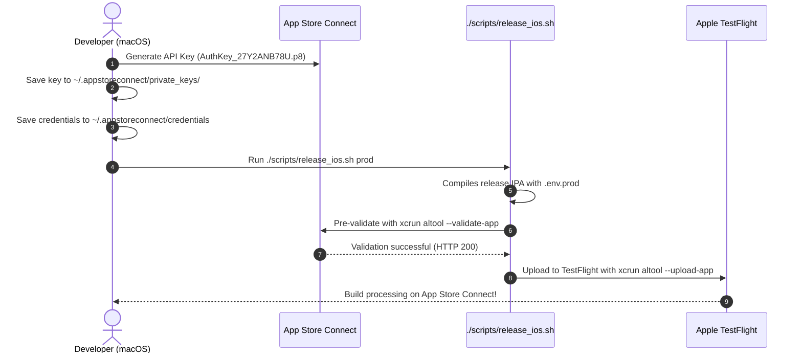

# Mobile Store Deployment & CI/CD Architecture: Android & iOS

> **Platforms:** Google Play Store (Internal / Closed / Production) & Apple App Store / TestFlight  
> **Model:** Hybrid Sovereign Architecture (Cloud Linux CI/CD for Android + Local Apple Silicon CLI for iOS)  
> **Environments:** Side-by-side Dual-App Architecture (Production vs. UAT / Staging)  
> **Ecosystem Companions:**  
> • [RexOne Core: Production Deployment Guide](https://github.com/rex-9/rexone-core/blob/dev/docs/DEPLOYMENT.md)  
> • [RexOne Web: Production Deployment Guide](https://github.com/rex-9/rexone-web/blob/dev/docs/DEPLOYMENT.md)  

---

## 🏛️ 1. Architecture Overview & Strategy

RexOne Mobile features a disciplined, cost-engineered **hybrid release architecture**:



### 1.1 The Hybrid Sovereign Release Strategy
- **Android on GitHub Actions**: Runs on standard `ubuntu-latest` Linux runners. Completely covered by standard GitHub Actions free tier quotas. Automated compilation of release `.apk` (for direct tester sideloads / GitHub Releases) and `.aab` (optimized Android App Bundle), followed by direct upload to Google Play **Internal Testing** via Google Cloud Service Account API.
- **iOS on Local Apple Silicon**: GitHub Actions charges 10x compute minutes for macOS runners with long queue times and high cost. A modern M-series Mac compiles an iOS release `.ipa` in under 90 seconds. With [`./scripts/release_ios.sh`](../scripts/release_ios.sh), pre-validation (`xcrun altool --validate-app`) and upload to Apple TestFlight (`xcrun altool --upload-app`) are executed in a single command with zero cloud bill.

---

### 1.2 Side-by-Side Dual-App Distribution (Prod vs UAT)

To eliminate testing friction, RexOne Mobile compiles into two distinct native applications that can be installed **side-by-side on the same physical smartphone**:

| Dimension | Production App | UAT / Staging App |
| :--- | :--- | :--- |
| **Git Branch** | `main` | `uat` |
| **Public Display Name** | `RexOne` | `RexOne UAT` |
| **Store Application ID** | `com.rex9.rexone` | `com.rex9.rexone.uat` |
| **Deep Link URL Scheme** | `rexone://` | `rexone-uat://` |
| **Configuration File** | `.env.prod` | `.env.uat` |
| **Google Play Track** | Internal Testing (`com.rex9.rexone`) | Internal Testing (`com.rex9.rexone.uat`) |
| **Apple TestFlight** | `RexOne` app record | `RexOne UAT` app record |
| **S3 Storage Isolation** | `prod/` folder prefix | `uat/` folder prefix |

> [!WARNING]
> **Dev & Prod Physical Device Overwrite Behavior**:
> Both local Development (`.env.dev`) and Production (`.env.prod`) compile under the primary base application ID (`com.rex9.rexone`).
> Deploying a local development build directly to a physical smartphone that already has the Production app installed will **overwrite** the Production app.
> To test pre-release features without replacing your installed Production app on physical devices, use **UAT / Staging** (`com.rex9.rexone.uat`), which possesses an isolated application ID and installs completely side-by-side.

> [!NOTE]
> **Static `namespace` vs Dynamic `applicationId`**:
> Android Gradle Plugin (AGP 8+) requires `namespace = "com.rex9.rexone"` to remain static so Kotlin `BuildConfig` and `R` classes compile without directory refactoring. Only `applicationId` switches dynamically based on `TARGET_ENV`, which is what Google Play and the Android OS inspect.

---

## 🛠️ 2. Prerequisites & Initial Readiness Checklist

Before configuring store accounts and CI secrets, verify your workstation environment:

1. **Flutter & Dart**: Flutter 3.x on the `stable` channel (`flutter --version`).
2. **Java JDK**: OpenJDK 21 (`java -version`).
   *(Required by Gradle 8.x / AGP 8.x. The scripts automatically detect macOS `java_home -v 21` or Homebrew `openjdk@21`).*
3. **Xcode**: Xcode 15+ installed with Command Line Tools (`xcode-select -p`).
4. **Firebase Configuration Files**:
   - `android/app/google-services.json` (must contain entries for both `com.rex9.rexone` and `com.rex9.rexone.uat`).
   - `ios/Runner/GoogleService-Info.plist`.
5. **Local Environment Files**: Ensure `.env.prod` and `.env.uat` are populated with proper API URLs and encryption keys.

---

## 🤖 3. Android Deployment Setup: Step-by-Step

Follow this exact 4-step sequence: **Generate Keystore ➔ Configure Google Cloud & Play Console ➔ Save GitHub Secrets ➔ Push and Let CI Handle It.**



---

### Step 3.1: Generate Android Upload Keystore (One-Time)

Generate your production signing key using the automated generator:

```bash
./scripts/generate_keystore.sh rexone upload
```

#### What this script does automatically:
1. Prompts you for a keystore password (store this in your password manager).
2. Generates an RSA 2048-bit release keystore valid for 10,000 days.
3. Saves to `android/keystores/rexone-upload-keystore.jks` and mirrors a safe backup to `~/.android/keystores/`.
4. Exports the public certificate: `android/keystores/rexone-upload-cert.pem`.
5. Encodes the keystore to Base64 and **automatically copies it to your macOS clipboard** (`pbcopy`).

---

### Step 3.2: Google Cloud & Play Console API Setup (One-Time)

To allow GitHub Actions to publish builds directly to Google Play without human intervention:

#### 1. Create Google Cloud Service Account
1. Open [Google Cloud Console](https://console.cloud.google.com) with the account owning your Google Play developer console.
2. Select or create your project (e.g. `rexone-mobile`).
3. Navigate to **IAM & Admin** ➔ **Service Accounts** ➔ **Create Service Account**.
   - Name: `play-store-publisher`
   - Role: **Service Account User**
4. Click into the newly created service account ➔ **Keys** tab ➔ **Add Key** ➔ **Create new key** ➔ **JSON**.
5. Save the downloaded JSON file to:
   ```text
   android/keystores/rexone-play-store-key.json
   ```

#### 2. Link Service Account in Google Play Console
1. Open [Google Play Console](https://play.google.com/console).
2. Navigate to **API Access** (under Developer Account settings).
3. Click **Link Google Cloud Project** and select your project.
4. Locate `play-store-publisher` under Service Accounts and click **Manage Play Console permissions**.
5. Grant the following permissions:
   - **Releases**: Create, edit, and delete draft releases; Release to production, exclude devices, and use App Bundle Explorer.
   - **Testing tracks**: Manage testing tracks and edit testing lists.
6. Click **Save Changes**.

#### 3. Initial Manual AAB Upload (Mandatory by Google)
> [!IMPORTANT]
> Google Play requires the **very first release** of any new package name to be uploaded manually through the Play Console web UI to activate the app record and register your upload certificate (`rexone-upload-cert.pem`).
> Subsequent releases are 100% automated by CI.

1. Build your initial release bundle locally:
   ```bash
   ./scripts/release_android.sh prod --bundle
   ```
2. In Google Play Console, click **Create App**:
   - App Name: `RexOne` (and `RexOne UAT` for staging)
   - Default Language & App / Game classification
3. Go to **Testing** ➔ **Internal Testing** ➔ **Create new release**.
4. Upload the generated `.aab` file from:
   ```text
   build/release-artifacts/rexone-prod-v1.0.0-b1.aab
   ```
5. Google Play App Signing will enroll your app and match your upload key certificate.
6. Repeat for `RexOne UAT` (`com.rex9.rexone.uat`) using:
   ```bash
   ./scripts/release_android.sh uat --bundle
   ```

---

### Step 3.3: Configure GitHub Repository Secrets (One-Time)

In your GitHub repository, go to **Settings** ➔ **Secrets and variables** ➔ **Actions** ➔ **New repository secret**.

Use the bundled clipboard helper scripts to copy each value in one keystroke:

| Secret Name | Clipboard Command / Helper Script | Purpose |
| :--- | :--- | :--- |
| `ANDROID_KEYSTORE_BASE64` | `./scripts/copy_keystore_base64.sh rexone` | Base64-encoded upload keystore |
| `KEYSTORE_PASSWORD` | *(Your keystore password)* | Password for the `.jks` file |
| `KEY_ALIAS` | `upload` | Alias name inside keystore |
| `KEY_PASSWORD` | *(Your key alias password)* | Password for the key alias |
| `PLAY_STORE_JSON_KEY` | `./scripts/copy_play_store_key.sh rexone` | Google Cloud Service Account JSON content |
| `ANDROID_GOOGLE_SERVICES_JSON`| `./scripts/copy_google_services_android.sh` | Full text of `android/app/google-services.json` |
| `IOS_GOOGLE_SERVICES_PLIST` | `./scripts/copy_google_services_ios.sh` | Full text of `ios/Runner/GoogleService-Info.plist` |
| `ENV_PROD` | `pbcopy < .env.prod` | Production environment variables |
| `ENV_UAT` | `pbcopy < .env.uat` | Staging / UAT environment variables |

---

### Step 3.4: Automated Hands-Off Releases

Once configured, GitHub Actions handles everything automatically:

```bash
# Deploy to UAT:
git checkout uat
git merge dev
# (Push uat branch to origin)
```
- **What happens on `uat`**:
  1. GitHub Actions triggers `.github/workflows/build_android.yaml`.
  2. Injects `.env.uat` and decodes your signing keystore.
  3. Automatically computes monotonic build number (`base_build + GITHUB_RUN_NUMBER`).
  4. Compiles `rexone-uat-v1.0.0-b15.apk` and `rexone-uat-v1.0.0-b15.aab`.
  5. Uploads the AAB directly to Google Play **Internal Testing** for `RexOne UAT`.
  6. Creates a GitHub Pre-Release with attached `.apk` and `.aab` for immediate direct downloads.

```bash
# Deploy to Production:
git checkout main
git merge uat
# (Push main branch to origin)
```
- **What happens on `main`**:
  1. Compiles production `rexone-prod-v1.0.0-b16.apk` and `rexone-prod-v1.0.0-b16.aab`.
  2. Uploads the production AAB directly to Google Play **Internal Testing** for `RexOne`.
  3. Tags a formal GitHub Release with release notes and downloadable binaries.
  4. You can promote this build to **Closed Testing**, **Open Testing**, or **Production** in Google Play Console with 1 click!

---

## 🍎 4. iOS Deployment Setup: Step-by-Step

Follow this exact 3-step sequence: **Create App Store Connect API Key ➔ Save Local Credentials ➔ Run `./scripts/release_ios.sh`.**



---

### Step 4.1: Generate App Store Connect API Key (One-Time)

Apple allows zero-prompt CLI uploads via App Store Connect API keys (`.p8`):

1. Sign in to [App Store Connect](https://appstoreconnect.apple.com).
2. Go to **Users and Access** ➔ **Integrations** tab ➔ **App Store Connect API**.
3. Click the `+` button to generate a new API Key:
   - **Name**: `RexOne Release Key` (or your app name)
   - **Access**: **App Manager** (or Admin)
4. Record your **Issuer ID** (UUID near top of page, e.g. `xxxxxxxx-xxxx-xxxx-xxxx-xxxxxxxxxxxx`).
5. Record your **Key ID** (10-character code, e.g. `27Y2ANB78U`).
6. Click **Download API Key** to download `AuthKey_<KEY_ID>.p8`.
   > [!WARNING]
   > Apple only allows you to download this file **once**. Store it securely.

---

### Step 4.2: Setup Local Credentials File (One-Time)

On your macOS workstation, save credentials to make all future builds 100% zero-prompt:

```bash
# 1. Create secure local directory
mkdir -p ~/.appstoreconnect/private_keys

# 2. Copy your downloaded .p8 key file
cp /path/to/AuthKey_<KEY_ID>.p8 ~/.appstoreconnect/private_keys/

# 3. Create credentials file
cat <<EOF > ~/.appstoreconnect/credentials
export APP_STORE_KEY_ID="<KEY_ID>"
export APP_STORE_ISSUER_ID="<ISSUER_UUID>"
EOF

# 4. Lock permissions to your user only
chmod 600 ~/.appstoreconnect/credentials
chmod 600 ~/.appstoreconnect/private_keys/AuthKey_*.p8
```

*(If you execute `./scripts/release_ios.sh` without this file, it will interactively prompt for your Key ID and Issuer ID and offer to save it for you automatically).*

---

### Step 4.3: App Store App Registration (One-Time)

1. In [Apple Developer Member Center](https://developer.apple.com/account):
   - Register App IDs under **Certificates, Identifiers & Profiles**:
     - `com.rex9.rexone` (Production)
     - `com.rex9.rexone.uat` (UAT / Staging)
   - Enable required capabilities: **Push Notifications**, **Associated Domains**, **Background Modes**.
2. In [App Store Connect](https://appstoreconnect.apple.com/apps):
   - Click `+` ➔ **New App**:
     - Name: `RexOne` (and `RexOne UAT`)
     - Bundle ID: select `com.rex9.rexone`
     - SKU: `rexone-ios` (and `rexone-uat-ios`)

---

### Step 4.4: Deploying to TestFlight via CLI

Publishing to TestFlight requires only one command from your Mac terminal:

```bash
# Build and upload Production IPA directly to TestFlight:
./scripts/release_ios.sh prod

# Build and upload UAT Staging IPA directly to TestFlight:
./scripts/release_ios.sh uat
```

#### What the script does automatically:
1. Validates macOS platform and Xcode command-line tools (`xcrun altool`).
2. Reads app version and build number from `pubspec.yaml`.
3. Injects `.env.prod` (or `.env.uat`) and compiles the native `.ipa` via Flutter.
4. Copies the IPA to `build/release-artifacts/rexone-<env>-vX.Y.Z-bN.ipa`.
5. Copies the artifact path to your clipboard (`pbcopy`) and reveals it in macOS Finder (`open -R`).
6. **Pre-validates** the IPA against Apple's ingestion servers (`xcrun altool --validate-app`).
7. **Uploads** the IPA directly to Apple TestFlight (`xcrun altool --upload-app`).

#### Useful Command Options:
```bash
# Pre-validate without uploading:
./scripts/release_ios.sh prod --validate-only

# Compile IPA locally only (offline testing):
./scripts/release_ios.sh prod --build-only

# Override build number for TestFlight monotonic requirement:
./scripts/release_ios.sh prod --build-number 25
```

---

## 🔢 5. Versioning & Monotonic Build Numbers

Both Google Play and Apple App Store strictly enforce **monotonically increasing build numbers**: you cannot upload a build with a version code or build number lower than or equal to an earlier upload.

### 5.1 The `version` Tag in `pubspec.yaml`
```yaml
version: 1.0.0+1
```
- **`1.0.0` (Version Name)**: The public semver displayed to users on app store pages.
- **`1` (Build Number)**: The internal machine counter (`versionCode` on Android, `CFBundleVersion` on iOS).

### 5.2 Automated CI Incrementing (Android)
In `.github/workflows/build_android.yaml`:
```bash
BUILD_NUMBER=$(( BASE_BUILD + GITHUB_RUN_NUMBER ))
```
Because GitHub Actions increments `GITHUB_RUN_NUMBER` with every commit, your CI builds are guaranteed to never collide or fail due to version code reuse.

### 5.3 Updating Version Numbers
When releasing new milestone versions, bump the version using the updater script:
```bash
# Syntax: ./scripts/update_app_version.sh <version_name>+<build_number>
./scripts/update_app_version.sh 1.1.0+20
```

---

## 🚦 6. Pre-Flight Release Checklist

Run these local checks before merging into `uat` or `main`:

```bash
# 1. Translation Parity Audit (verifies en_US and my_MM key symmetry)
./scripts/check_locales.sh

# 2. Dead Code Translation Audit (identifies unused translation keys)
./scripts/check_locales.sh --unused

# 3. Secret Scanner (ensures no real .env or secrets are staged for Git)
./scripts/check_secrets.sh

# 4. Automated Unit & Widget Test Suite
flutter test test/

# 5. Static Code Analysis
flutter analyze lib/ test/ integration_test/
```

---

## 🚒 7. Troubleshooting & Common Store Pitfalls

| Symptom / Error | Root Cause | Exact Resolution |
| :--- | :--- | :--- |
| **Android CI**: `Upload key certificate does not match` | Google Play App Signing expects a different certificate from the one used to sign the AAB | Go to Google Play Console ➔ **App Integrity** ➔ **Request upload key reset** and upload `android/keystores/rexone-upload-cert.pem`. |
| **Android CI**: `Version code X has already been used` | An earlier release in Google Play already used that build number | Run `./scripts/update_app_version.sh 1.0.0+<higher_num>` or push another commit to advance `GITHUB_RUN_NUMBER`. |
| **Android CI**: `Google Services JSON missing` | `ANDROID_GOOGLE_SERVICES_JSON` secret not configured in GitHub | Run `./scripts/copy_google_services_android.sh` and paste into GitHub Secrets. |
| **iOS**: `No suitable application records were found` | App record is missing in App Store Connect or API key lacks permissions | Create the app in App Store Connect under the registered Bundle ID (`com.rex9.rexone`). Ensure API Key has **App Manager** role. |
| **iOS**: `Asset validation failed: invalid bundle identifier` | Native `Info.plist` bundle ID does not match App Store Connect app | Check `Info.plist` and `TARGET_ENV`. Ensure both `com.rex9.rexone` and `com.rex9.rexone.uat` are registered. |
| **iOS**: `Could not locate built .ipa in build/ios/ipa/` | macOS iCloud Drive relocated build directory or created `.nosync` | `release_ios.sh` automatically checks `build.nosync/ios/ipa/`. If still missing, run `flutter clean && flutter pub get`. |
| **iOS**: `401 Unauthorized / Token expired` | Local machine time is out of sync or API Key ID / Issuer ID is mistyped | Verify `~/.appstoreconnect/credentials` values. Check macOS system clock in **System Settings** ➔ **General** ➔ **Date & Time**. |

---

## 🔄 8. Product Rebranding Workflow

When spinning off a new white-labeled or derivative product from the RexOne foundation:

```bash
# Option A: Ecosystem-wide Rebranding from Core (Core API, Web, and Mobile simultaneously)
cd ../rexone-core && ./scripts/rebrand.sh

# Option B: Standalone Mobile Rebranding
./scripts/rebrand.sh "Acme App" "com.acme.app" "path/to/logo.png"
```

The rebranding engine automatically updates:
1. `APP_NAME` and `PACKAGE_BASE` in Android Manifest & iOS Info.plist.
2. Keystore file references in `android/app/build.gradle.kts`.
3. Parameter contracts inside `release_android.sh`, `release_ios.sh`, and `.github/workflows/build_android.yaml`.
4. App launcher icons across all Android and iOS display densities.
